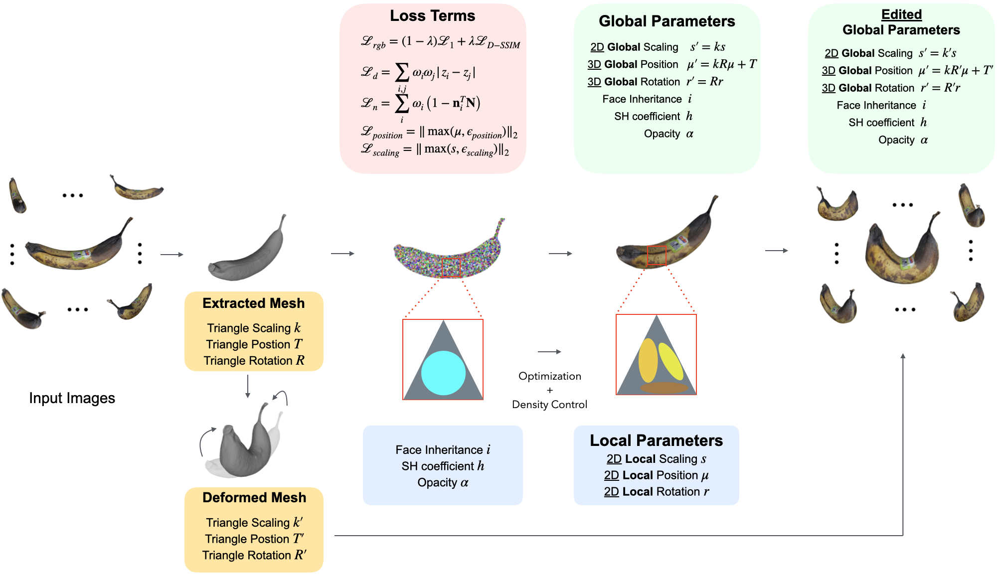
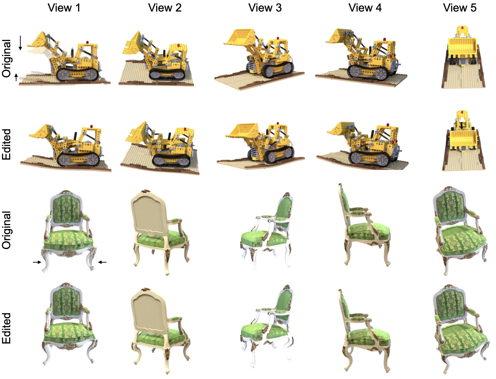

# Editable 2D Gaussian Splatting with As-Rigid-As-Possible Mesh Deformation
[GaussCraft](https://github.com/jiwonhaha/cgvi_thesis)

This repository contains the implementation of GaussCraft, a tool for editable 2D Gaussian Splatting combined with As-Rigid-As-Possible (ARAP) mesh deformation.

## Model Overview


### Result Images

<div style="display: flex;">
    <div style="flex: 1; padding: 5px;">
        <p>Evaluation on NeRF Synthetic Dataset</p>
        
    </div>
</div>

## Installation

### Using an Existing Conda Environment

If you already have a conda environment set up for 2D Gaussian Splatting, you can use it directly. Otherwise, follow the instructions below for a new installation.

### New Installation

1. Clone the repository:
    ```bash
    git clone https://github.com/jiwonhaha/cgvi_thesis.git --recursive
    cd cgvi_thesis
    ```

2. Create and activate the conda environment:
    ```bash
    conda env create --file environment.yml
    conda activate surfel_splatting
    ```

3. Install the required Python packages:
    ```bash
    pip install viser==0.1.29
    pip install splines
    pip install lightning
    ```

## Training

### Viewing a 2D GS PLY File

1. Use the original 2D GS code to start:
    ```bash
    python train.py -s <data source path> -m <output data path>
    ```

2. Extract the mesh:
    ```bash
    python render.py -s <data source path> -m <output data path> --depth_ratio 1 --skip_test --skip_train
    ```

### Extracting and Training the Mesh

1. Train 2D GS with binding to the mesh:
    ```bash
    python train.py -s <data source path> -m <output data path> --mesh_path <path to original mesh>
    ```

2. Using ARAP Mesh Deformation:
    User can use interactive selection for handles and static vertices:
    ```bash
    python arap.py <path to reconstructed mesh> 
    ```

3. View the edited rendering:
    ```bash
    python viewer.py <path to pre-trained model> <or direct path to the ply file> -s <data source path> --mesh_path <path to deformed mesh>
    ```

## Testing

```bash
python matric_mesh.py --gt_dir <path to gt dir> --test_dir <path to test dir>
```

### Bounded Mesh Extraction

To export a mesh within a bounded volume, simply use:
```bash
python render.py -m <path to pre-trained model> -s <path to dataset> 
```
Commandline arguments you should adjust accordingly for meshing for bounded TSDF fusion, use
```bash
--depth_ratio # 0 for mean depth and 1 for median depth
--voxel_size # voxel size
--depth_trunc # depth truncation
```
If these arguments are not specified, the script will automatically estimate them using the camera information.
### Unbounded Mesh Extraction
To export a mesh with an arbitrary size, we devised an unbounded TSDF fusion with space contraction and adaptive truncation.
```bash
python render.py -m <path to pre-trained model> -s <path to dataset> --mesh_res 1024
```

**Custom Dataset**: We use the same COLMAP loader as 3DGS, you can prepare your data following [here](https://github.com/graphdeco-inria/gaussian-splatting?tab=readme-ov-file#processing-your-own-scenes). 
